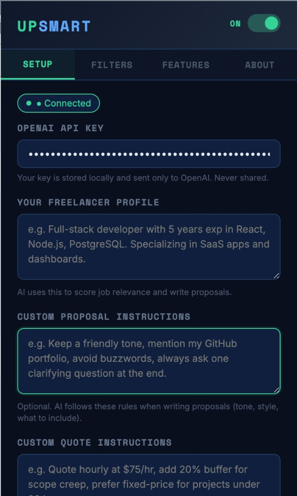
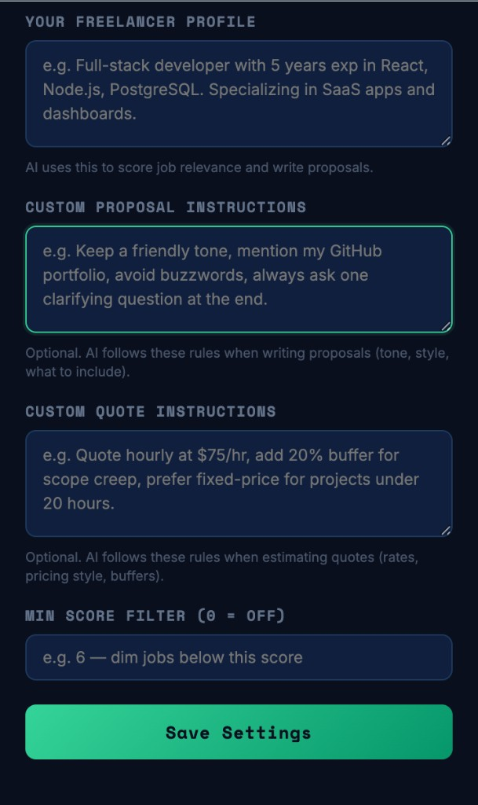
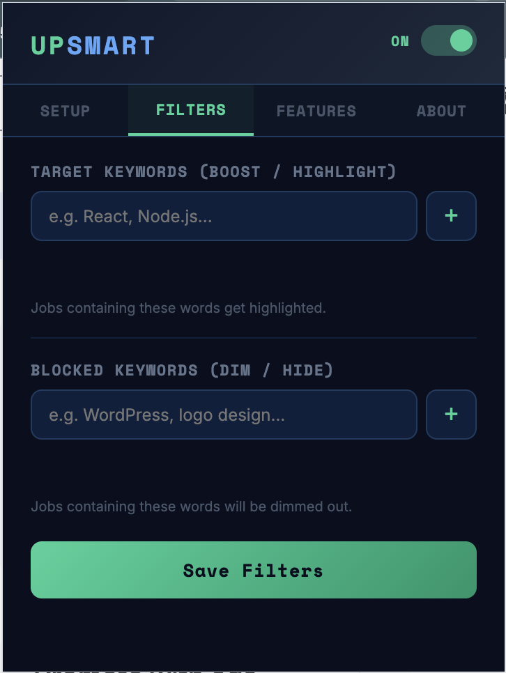
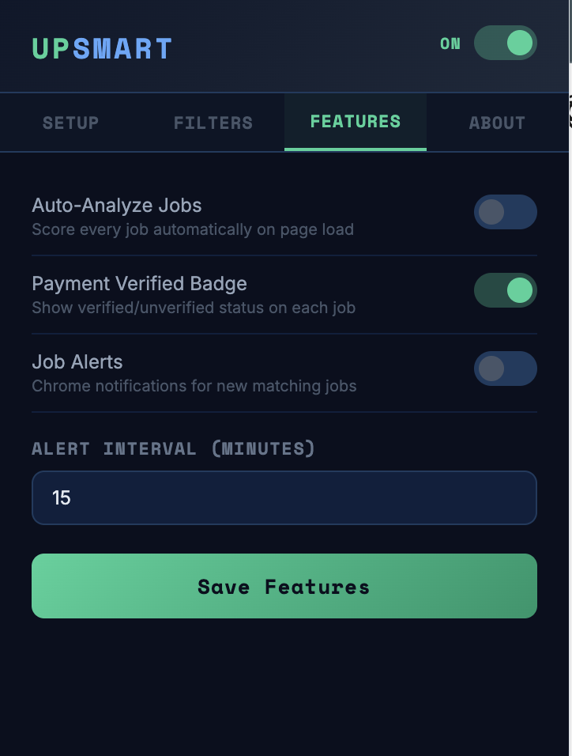
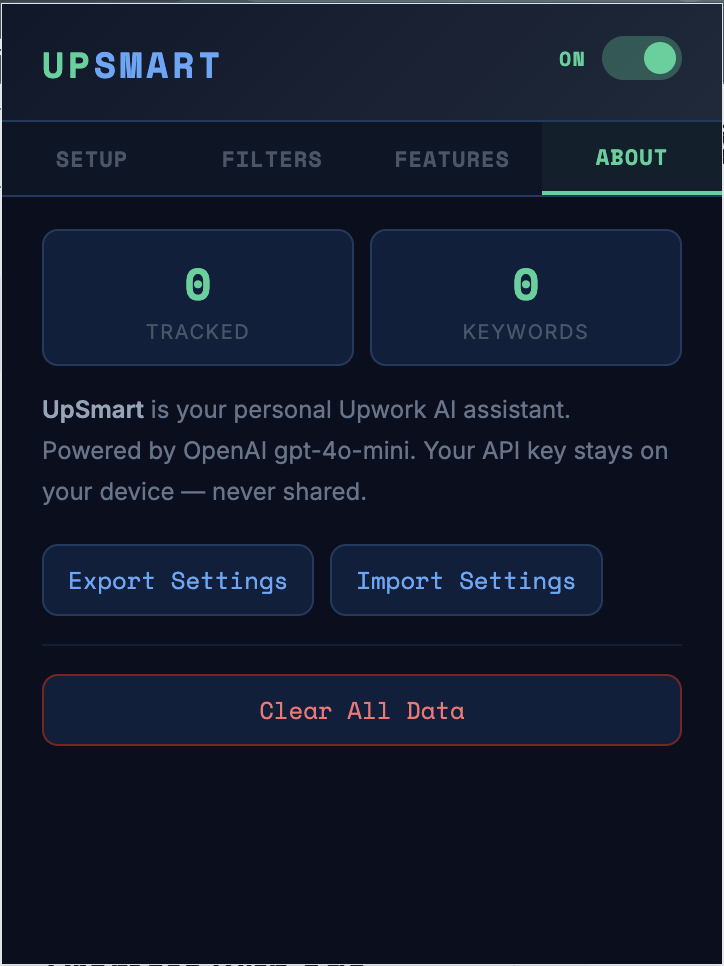

<div align="center">

# ⚡ UpSmart

**Your personal AI assistant for Upwork**

Score jobs, filter noise, write proposals, estimate quotes, and track applications — all inside Upwork.

<br/>


</div>

---

## What is UpSmart?

UpSmart is a **Chrome extension** that supercharges your Upwork job search. It injects directly into Upwork job pages and gives you AI-powered tools to work faster and smarter.

Instead of manually reading every posting, guessing if a job is worth your time, and writing cover letters from scratch — UpSmart helps you:

- **Score jobs** against your freelancer profile (1–10 with red/green flags)
- **Filter out noise** with keyword highlighting and blocked-word dimming
- **Generate proposals** tailored to each job, with your own custom writing rules
- **Estimate quotes** with pricing guidance and negotiation tips
- **Track applications** in a built-in sidebar (Saved → Applied → Interviewing → Won/Lost)
- **Stay alerted** with optional Chrome notifications for matching jobs

Your OpenAI API key and all settings stay **on your device**. No accounts, no third-party servers, no tracking.

---

## Screenshots

### Setup — Connect OpenAI & configure your profile

<p align="center">
  
</p>

<p align="center">
  
</p>

Set your API key, describe your skills, and add **custom instructions** so the AI writes proposals and quotes exactly the way you want.

---

### Filters — Highlight good jobs, dim bad ones

<p align="center">
  
</p>

Add **target keywords** (React, Node.js…) to highlight matching jobs. Add **blocked keywords** (WordPress, logo design…) to dim irrelevant ones.

---

### Features — Toggle automation & alerts

<p align="center">
  
</p>

Turn on auto-analyze, payment verified badges, and job alert notifications with a configurable poll interval.

---

### About — Stats, export/import, data control

<p align="center">
  
</p>

View your tracked jobs and keyword counts. Export or import all settings, or clear data entirely.

---

## Features

<table>
<tr>
<td width="50%" valign="top">

### 🎯 Smart Filtering
- **Keyword highlighting** — boost jobs that match your stack
- **Blocked keywords** — dim jobs you never want to see
- **Quick text filter** — search visible jobs from the toolbar
- **Min score filter** — auto-dim jobs below your threshold

</td>
<td width="50%" valign="top">

### 🤖 AI-Powered (OpenAI)
- **✦ Score** — 1–10 rating with red/green flags & match reason
- **✍ Proposal** — personalized cover letter per job
- **$ Quote** — fair price estimate + negotiation tip
- **Analyze All** — score every visible job in one click
- **Auto-Analyze** — score jobs automatically on page load

</td>
</tr>
<tr>
<td width="50%" valign="top">

### 📊 Job Tracker
- Save jobs with **+ Track**
- Open the **TRACKER** sidebar on Upwork
- Status pipeline: Saved → Applied → Interviewing → Won / Lost
- Filter by status, search by title

</td>
<td width="50%" valign="top">

### 🔒 Privacy & Control
- API key stored locally in `chrome.storage.local`
- Sent only to OpenAI — never to third parties
- Master ON/OFF toggle in popup and toolbar
- Export / import settings as JSON

</td>
</tr>
</table>

---

## How it works

```
┌─────────────────────────────────────────────────────────────┐
│  Upwork job page                                            │
│  ┌───────────────────────────────────────────────────────┐  │
│  │  Each job card gets UpSmart controls:                   │  │
│  │  [⚡ Score] [✓ Verified] [✦ Score] [✍ Proposal]        │  │
│  │  [$ Quote] [+ Track]                                    │  │
│  └───────────────────────────────────────────────────────┘  │
│                                                             │
│  ┌───────────────────────────────────────────────────────┐  │
│  │  Bottom toolbar: Analyze All · Clear Filters · Filter │  │
│  └───────────────────────────────────────────────────────┘  │
└─────────────────────────────────────────────────────────────┘
         │                              │
         ▼                              ▼
   Your profile +              OpenAI GPT-4o-mini
   custom instructions         (direct API call)
```

1. Open a supported Upwork jobs page
2. UpSmart injects controls on every job card + a bottom toolbar
3. Click **✦ Score**, **✍ Proposal**, or **$ Quote** — AI uses your profile and custom instructions
4. Track promising jobs in the sidebar and manage them over time

---

## Installation

> Takes about 2 minutes. No build step required.

1. **Clone or download** this repository
   ```bash
   git clone https://github.com/your-username/up-smart.git
   cd up-smart
   ```

2. Open Chrome and go to **`chrome://extensions`**

3. Enable **Developer mode** (top-right toggle)

4. Click **Load unpacked** → select the project folder

5. Click the **⚡ UpSmart** icon in your toolbar

6. Go to **Setup** → paste your [OpenAI API key](https://platform.openai.com/api-keys) → fill your profile → **Save Settings**

7. Visit any supported Upwork URL (see below) and refresh the page

---

## Supported pages

UpSmart activates automatically on these Upwork URLs:

| Page | URL |
|------|-----|
| Universal search | `upwork.com/nx/s/universal-search/jobs` |
| Job search | `upwork.com/nx/search/jobs` |
| Saved searches | `upwork.com/nx/s/*/jobs` |
| Find work — Best matches | `upwork.com/nx/find-work/best-matches` |
| Find work — Most recent | `upwork.com/nx/find-work/most-recent` |
| Other find work tabs | `upwork.com/nx/find-work/*` |

---

## Settings reference

| Setting | Tab | Description |
|---------|-----|-------------|
| OpenAI API Key | Setup | Your key from platform.openai.com — stored locally |
| Freelancer Profile | Setup | Your skills & experience — used for scoring, proposals, quotes |
| Custom Proposal Instructions | Setup | Optional tone, style, and content rules for cover letters |
| Custom Quote Instructions | Setup | Optional pricing rules (hourly rate, buffers, fixed vs hourly) |
| Min Score Filter | Setup | Dim jobs scoring below this (0 = off) |
| Target Keywords | Filters | Highlight jobs containing these words |
| Blocked Keywords | Filters | Dim jobs containing these words |
| Auto-Analyze | Features | Score every job automatically on page load |
| Payment Verified Badge | Features | Show ✓ Verified / ✗ Unverified on each job |
| Job Alerts | Features | Chrome notifications for matching jobs |
| Alert Interval | Features | How often to check (1–30 minutes) |

---

## API cost estimate

UpSmart uses **`gpt-4o-mini`** — the most affordable GPT-4 class model.

| Action | Approx. cost |
|--------|-------------|
| Job analysis (✦ Score) | ~$0.001 |
| Proposal (✍) | ~$0.002 |
| Quote ($) | ~$0.001 |

**Example:** Analyzing 50 jobs/day ≈ **$1.50/month**

Check usage at [platform.openai.com/usage](https://platform.openai.com/usage).

---

## Privacy

| | |
|---|---|
| ✅ API key | Stored in `chrome.storage.local` on your machine |
| ✅ Job tracker & settings | Stored locally in your browser |
| ✅ AI requests | Sent directly from your browser to OpenAI |
| ❌ Third-party servers | None |
| ❌ Accounts or tracking | None |

---

## Troubleshooting

<details>
<summary><strong>Extension not showing on Upwork?</strong></summary>

- Make sure you're on a [supported jobs page](#supported-pages)
- Refresh the page after installing or reloading the extension
- Check the master **ON** toggle in the popup and bottom toolbar

</details>

<details>
<summary><strong>"No API key" error?</strong></summary>

- Click the ⚡ icon → **Setup** → paste your OpenAI key → **Save Settings**
- The status indicator should show **● Connected**

</details>

<details>
<summary><strong>AI not analyzing / proposals failing?</strong></summary>

- Verify your OpenAI key has credits at [platform.openai.com/usage](https://platform.openai.com/usage)
- Refresh Upwork after saving new settings (profile, custom instructions)

</details>

<details>
<summary><strong>Settings not applying on Upwork?</strong></summary>

- Save in the popup, then **refresh** any open Upwork tabs
- The content script loads settings once per page load

</details>

---

## Project structure

```
up-smart/
├── manifest.json              # Extension config & URL matches
├── docs/screenshots/          # README screenshots
├── public/icons/              # Extension icons
└── src/
    ├── popup/                 # Settings UI (Setup, Filters, Features, About)
    ├── content/               # Injected into Upwork pages
    ├── sidebar/               # Job tracker panel
    ├── background/            # Alerts & message routing
    └── api/                   # OpenAI prompt helpers
```

---

<div align="center">

**Built for personal use.**

No Chrome Web Store publishing required. No accounts. Just you, Upwork, and AI.

<br/>

⚡ **UpSmart** — work smarter on Upwork.

</div>
